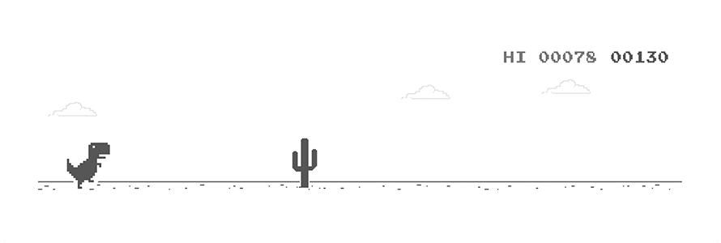

<!-- wave dropping svg -->

	

<!-- lang table -->
<table align="right">
	<tr><td><a href="README.md" color="02D892"> English</a></td></tr>
	<tr><td><a href="README_pt.md" color="02D892"> Português</a></td></tr>
	<tr><td><a href="README_es.md" color="02D892"> Español</a></td></tr>
</table>

<!-- stats -->

	<a href="https://github.com/Daniel-CreeperEvil1227">
	
	&nbsp;
	

<!-- social media icons -->

	
<b>😄 &nbsp;Connect with me:</b>

	 
	<!-- [][][] < cloud icons -->

<!-- current lang/tool icons -->

	
<b>📝 &nbsp; I'm currently learning / improving on:</b>

	 
	<!-- [][][] < icons -->

<!-- lang icons -->

	
<b>👩‍💻 &nbsp; Languages I learned:</b>

	 
	<!-- [][][] < icons -->

<!-- tool icons -->

	
<b>🛏 &nbsp; Tools I use:</b>

	 
	<!-- [][][] < icons -->

<!--
gamelife

<picture>
  <source media="(prefers-color-scheme: dark)" srcset="github-snake-dark.svg" />
  <source media="(prefers-color-scheme: light)" srcset="github-snake.svg" />
  
</picture>
-->

<!-- repo list -->

	
	&nbsp;
	

<!-- dinosaur gif -->
<a href="https://trex-runner.com/" title='Play "Dinosaur Run" '>
	
<a/>

<!-- wave svg -->

	

