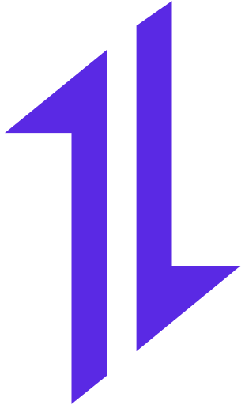
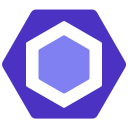
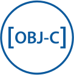

<!-- wave dropping svg -->

	

<!-- typing animation -->

<!-- lang table -->
<table align="right">
	<tr title="Access the English version"><td><a href="README.md" color="02D892" aria-label="Access the English version">&nbsp; English</a></td></tr>
	<tr title="Acessar versão em Português"><td><a href="README_pt.md" color="02D892" aria-label="Acessar versão em Português">&nbsp; Português</a></td></tr>
	<tr title="Accede a la versión en español"><td><a href="README_es.md" color="02D892" aria-label="Accede a la versión en español">&nbsp; Español</a></td></tr>
</table>

<!-- stats -->

	<a href="https://github.com/Daniel-CreeperEvil1227">
	
	&nbsp;
	

<!-- social media icons -->

	
<b>😄 &nbsp;Connect with me:</b>

	 
	

	
<!-- current lang/tool icons -->

	
<b>📠&nbsp; I'm currently learning / improving on:</b>

	 
	
	
	

<!-- lang icons -->

	
<b>👩‍💻 &nbsp; Languages and Libs/Frameworks I learned:</b>

	 
	

		
		
		
		
		
		
		
	

	

		
		
		
		
		
		
		
	

<!-- tool icons -->

	
<b>🛠&nbsp; Tools I use:</b>

	 
	

		
		
		
		
		
		
		
	

	

		
		
		
		
		
		
		
	

<!-- any lang/tool icons -->

	
<b>📚 &nbsp; I'm interested in learning:</b>

	 
	

		
<b>💡 &nbsp; Libs and Frameworks:</b>

		 
		

			
			
			
			
			
		

		

			
			
			
			
			
		

	

	

		
<b>📋 &nbsp; Languages:</b>

		 
		

			
			
			
			
			
			
		

		

			
			
			
			
			
			
		

	

	

		
<b>🗃 &nbsp; Database Techs:</b>

		 
		

			
			
			
			
			
			
		

	

	

		
<b>⛅ &nbsp; Cloud Service Techs:</b>

		 
		

			
			
			
			
			
			
		

		

			
			
			
		

	

<!--
gamelife

<picture>
  <source media="(prefers-color-scheme: dark)" srcset="github-snake-dark.svg" />
  <source media="(prefers-color-scheme: light)" srcset="github-snake.svg" />
  
</picture>
-->

<!-- repo list -->

	
	&nbsp;
	

<!-- dinosaur gif -->

	

<!-- wave svg -->

	

